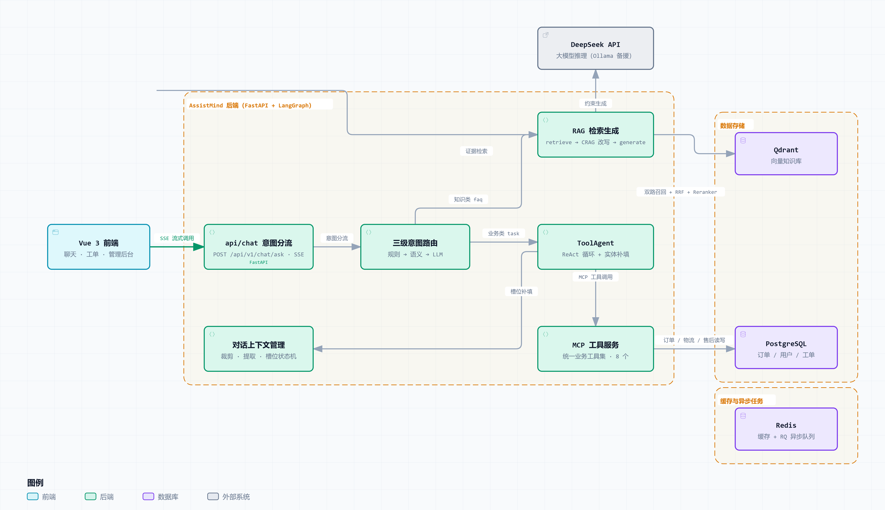
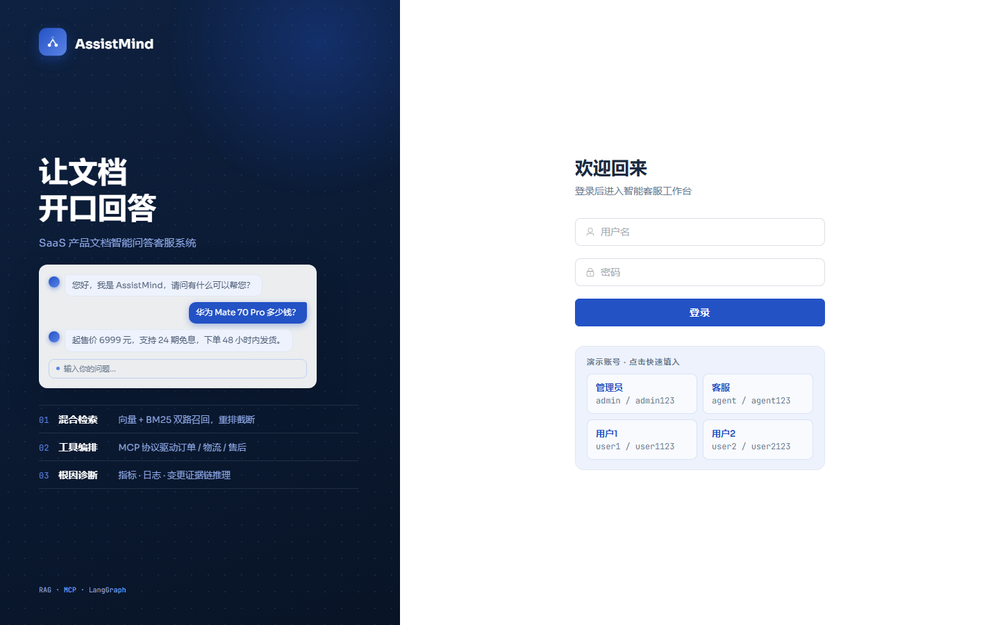
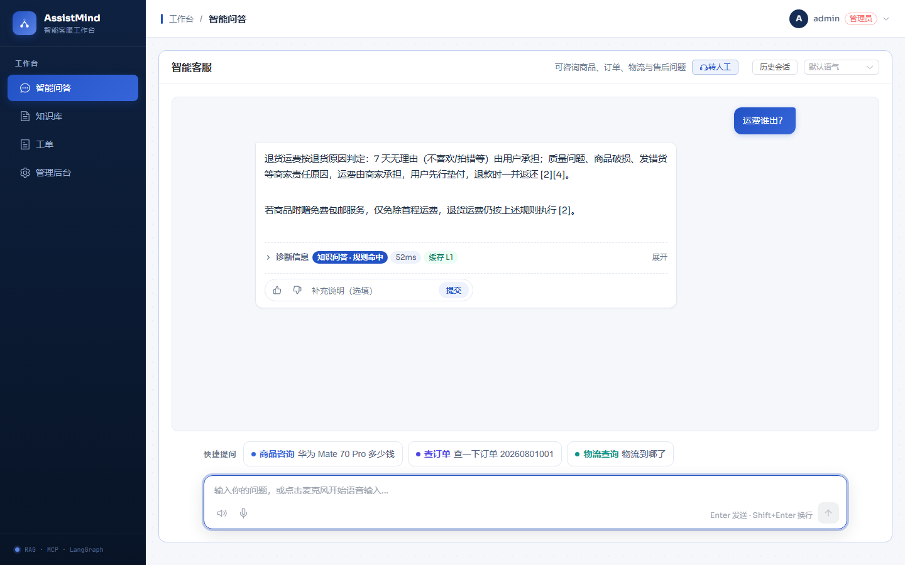
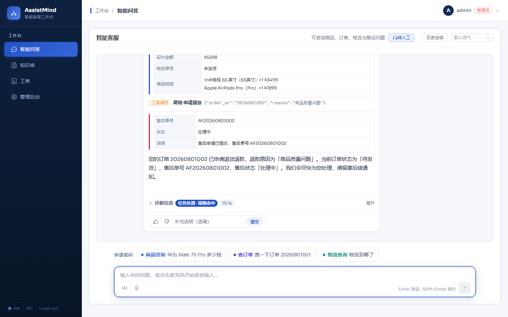
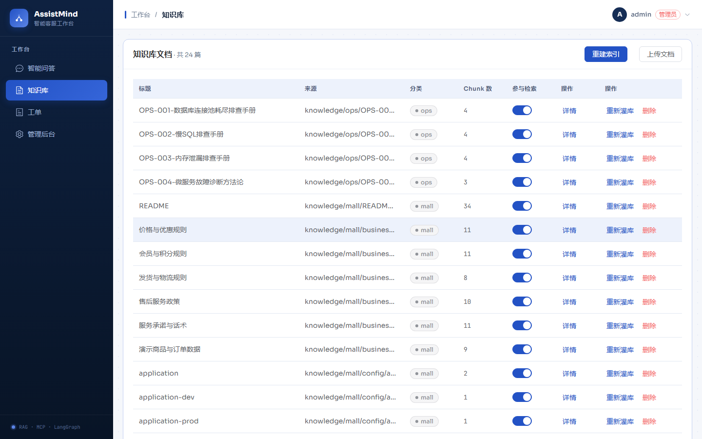
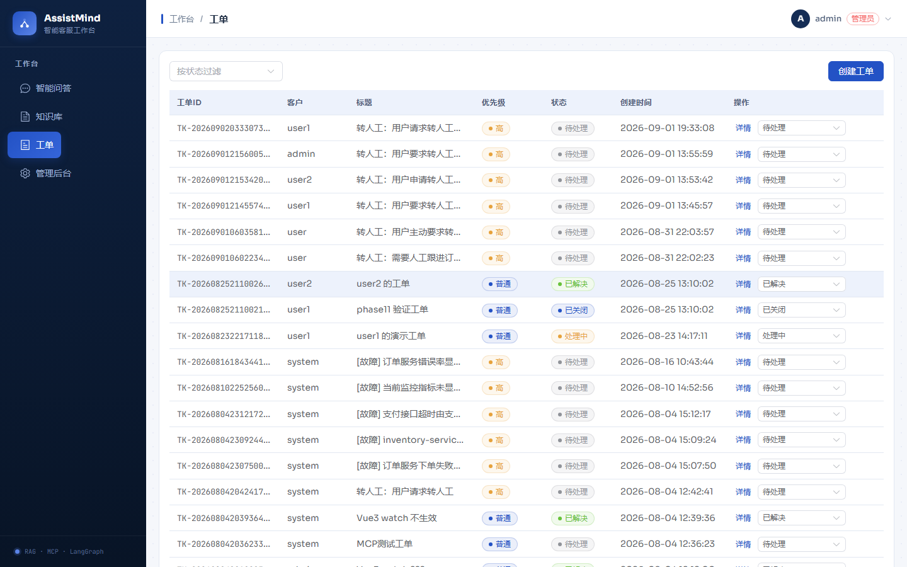
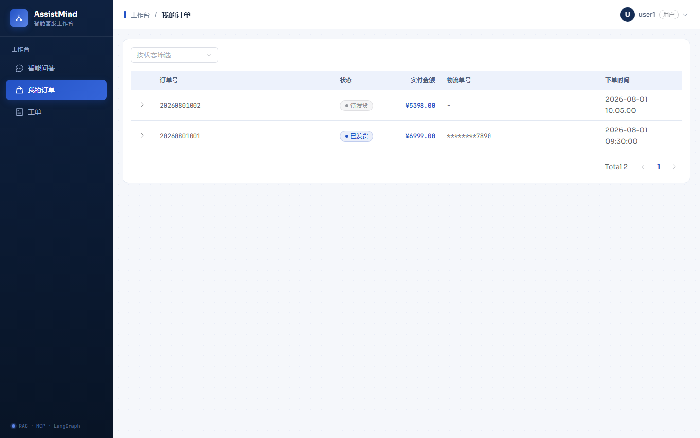
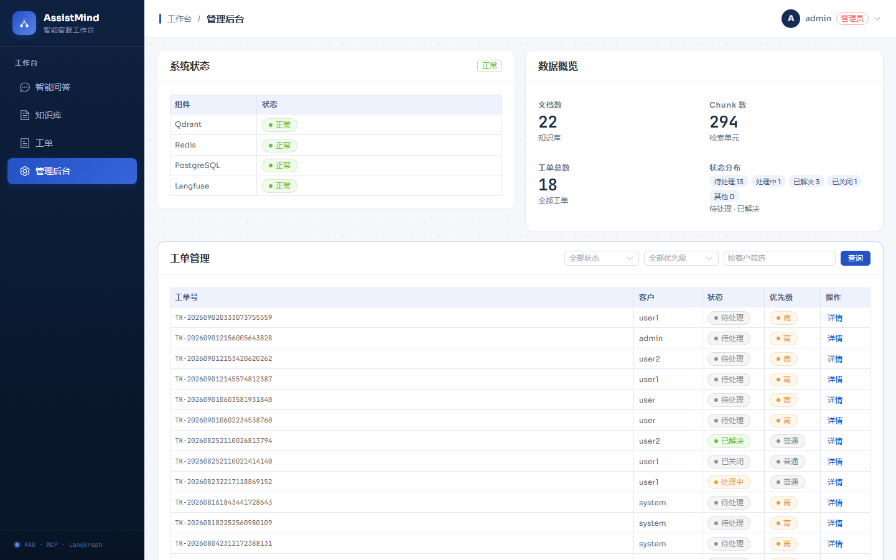
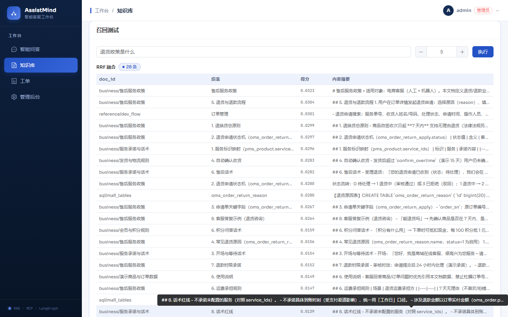

# AssistMind —— 电商智能客服系统

> 电商智能客服系统：RAG + Agent，覆盖**电商客服问答**（商品咨询 / 订单查询 / 物流查询 / 售后申请）与**转人工 / 工单闭环**。
> 知识库素材取自开源项目 [macrozheng/mall](https://github.com/macrozheng/mall) 的文档与表结构，业务数据为项目自建（见[知识来源与致谢](#知识来源与致谢)）。

**目录**：[界面预览](#界面预览) · [功能特性](#功能特性) · [核心场景](#核心场景) · [快速开始](#快速开始) · [配置说明](#配置说明) · [设计细节](#设计细节) · [技术栈](#技术栈) · [评估](#评估) · [项目结构](#项目结构) · [知识来源与致谢](#知识来源与致谢) · [License](#license)



> 交互版：[docs/assistmind-architecture.html](docs/assistmind-architecture.html)，支持缩放，每个组件可溯源到对应源码路径。

## 界面预览

> 以下截图来自本地演示环境（真实对话链路：RAG 检索生成、Agent 经 MCP 调用业务工具）。

| | |
|---|---|
|  |  |
|  |  |
|  |  |
|  |  |


## 功能特性

- **RAG 混合检索**：Qdrant 向量召回 + BM25 关键词召回（jieba 词粒度）双路并行，RRF 融合（权重可配），Reranker 精排
- **查询改写**：Multi-Query 默认启用（3 变体并行召回）+ HyDE 可选 + CRAG 低分被动改写
- **结构感知切块**：Markdown 标题 / fenced 代码块整体保留 / 表格不拆行 / mall_tables.sql 按 CREATE TABLE 表级切块
- **Agent 工具调用**：ToolAgent（ReAct）经 MCP 调用工具完成订单校验 → 售后申请 → 工单创建，每步以 SSE 事件推送到前端
- **MCP Server + Client**：FastMCP 实现 Server（8 个工具）+ Client，ToolAgent 与工具实现解耦
- **三级意图路由**：规则 → 语义 → LLM，4 类意图（faq / task / chat / unclear），配置外置热加载
- **失败降级体系**：断路器 + 全链路降级表，BM25 为一等公民（Qdrant 挂掉仍可答）
- **异步任务队列（RQ）**：知识库重建 / 坏例回流 / 评估运行收编为 Redis 异步任务，HTTP 秒回 job_id、独立 worker 进程消费、失败自动重试、状态可轮询
- **语音 AI**：ASR 用浏览器 Web Speech API（本地识别）+ TTS 两级降级（后端 edge-tts 云端音色 → 浏览器合成兜底）
- **角色语气定制**：人格库外置 `personas.json`（专业/温柔/活泼），mtime 热加载，提示词层实现语气切换，无需 GPU 微调
- **可观测性**：Langfuse 全链路 trace（LLM 单点埋点 + FAQ 会话级 trace）
- **评估体系**：RAGAS 4 指标（mall 数据集 40 条，含 5 条对抗样本）
- **Bad Case 回归**：用户反馈 → Langfuse 会话级证据链 → 管理端可视化追溯 → 低分样本自动回流评估集回归（详见 `docs/rag-iteration.md`）
- **CI/CD**：GitHub Actions（ruff + pytest + vitest）+ husky pre-commit

## 核心场景

### 电商客服：RAG 问答 + Agent 工具调用

面向电商客服的两类典型问题，系统按意图自动分流：

| 场景 | 用户问题示例 | 处理链路 |
|---|---|---|
| 商品 / 政策咨询 | "运费谁出？""优惠券能叠加吗？""退货政策是什么？" | faq 意图 → RAG 检索（向量 + BM25 + RRF + Rerank + CRAG）→ 基于知识库生成 |
| 订单 / 物流查询 | "查一下我的订单""物流到哪了？" | task 意图 → ToolAgent → MCP 调 `query_order` / `query_logistics` |
| 售后申请 | "我要退货""我要申请售后" | task 意图 → ToolAgent → `query_order` 校验状态 → `apply_refund` 创建售后单 → 生成工单 |
| 转人工 / 建工单 | "帮我转人工""提交一个工单" | task 意图 → ToolAgent → `transfer_human` / `create_ticket` |

前端以 SSE 流式呈现全过程：意图分流标签 → 查询改写提示 → 工具调用步骤（工具名 + 参数 + 结果）→ 知识来源引用 → 最终答案。

### 示例：「我要退货」的完整调用过程

一次完整调用：

> 用户输入"我要退货" →
> 1. **意图路由**：命中 task 意图（关键词 + 语义样本命中，不消耗 LLM）；
> 2. **ToolAgent 决策**：ReAct 循环中先按"Retrieval Before Agency"原则检索售后政策知识（确认退货前提：订单已发货/已完成、7 天无理由等），再决定动作；
> 3. **校验订单状态**：调用 `query_order("20260801001")`，返回订单状态"已发货"（可售后），如实转述，不编造；
> 4. **创建售后单**：调用 `apply_refund(order_sn, reason)`，数据源校验状态并创建售后单（`refund_id=AF{order_sn}`，重复申请幂等返回已存在记录）；
> 5. **生成工单**：按需调用 `create_ticket` 沉淀售后/问题工单，与用户核对处理时效；
> 6. **告知结果**：结构化输出售后单号、当前状态（处理中）与后续流程。

每一步的工具调用都以 `tool_call` / `tool_result` SSE 事件实时推送到前端，用户可见"正在查订单 → 正在申请售后 → 已创建售后工单"的过程。

> 说明：订单 / 物流 / 售后数据默认走内存 mock（零依赖）；配置 `MALL_DATA_SOURCE=real` 后可落 PostgreSQL 持久化（含售后单跨进程幂等），见[配置说明](#配置说明)。

## 快速开始

### 1. 环境准备

```powershell
# 克隆仓库
git clone <repo-url>
cd AssistMind

# 后端虚拟环境
cd backend
python -m venv venv
venv\Scripts\activate
pip install -e ".[dev]"
cp .env.example .env
# 编辑 .env 填入 DEEPSEEK_API_KEY
```

> 可选：已安装 uv 时可用 `uv sync --frozen --extra dev` 按 `backend/uv.lock` 锁定版本安装。

### 2. 启动依赖服务（docker-compose）

```powershell
docker-compose up -d
```

核心服务一览（langfuse 依赖的 redis/clickhouse/minio/worker 等子服务从略）：

| 服务 | 容器 | 端口 | 说明 |
|---|---|---|---|
| qdrant | smart-cs-qdrant | 6333 / 6334 | 向量库 |
| redis | smart-cs-redis | 6379 | 缓存 / 语义缓存 |
| postgres | smart-cs-postgres | 5432 | 元数据库（用户/工单/反馈） |
| langfuse-db / langfuse | smart-cs-langfuse-* | 3001 | 可观测平台（可选，开发环境默认启动） |

> 应用层 backend / frontend / **worker** 由 `docker-compose.app.yml` 定义（与根 `docker-compose.yml` 叠加，`start-demo.ps1` 或 `docker compose -f docker-compose.yml -f docker-compose.app.yml up -d` 全量启动）。其中 **worker** 消费 RQ 异步任务队列（知识库重建等），rebuild 入队后需该进程执行——手动开发模式下请单独启动（见下节）。

### 3. 初始化数据库 + 灌知识库

```powershell
cd backend

# 建表 + 初始用户（admin/agent/user）
venv\Scripts\python.exe scripts/init_db.py

# 电商业务数据落 PostgreSQL（MALL_DATA_SOURCE=real 时使用；默认 mock 可跳过）
# 数据来源与 mock 演示清单同源（scripts/seed_mall_db.py 从 mock_source 导入，幂等）
venv\Scripts\python.exe scripts/seed_mall_db.py

# 电商知识库（knowledge/mall/：官方文档 + 自建业务规则，结构感知切块）
venv\Scripts\python.exe scripts/seed_mall_kb.py --reset

```

### 4. 启动开发服务器

```powershell
# 后端（终端 1）
cd backend
uvicorn app.main:app --reload --port 8002

# RQ worker（终端 2，可选但推荐）：消费异步任务（知识库重建/坏例回流/评估运行），
# 不启动则 rebuild 入队后保持 queued 不执行
venv\Scripts\python.exe scripts/run_worker.py

# 前端（终端 3）
cd frontend
npm install
npm run dev
```

### 5. 访问

- 前端：http://localhost:5173
- 后端 API 文档：http://localhost:8002/docs
- Langfuse：http://localhost:3001
- 测试账号：admin/admin123（管理员）· agent/agent123（客服）· user/user123（普通用户）

### 6. 一键启动与部署

- **一键启动**（推荐）：仓库根直接 `.\start-demo.ps1` —— 预检环境、等依赖健康、自动建库 + 首启灌库（向量集合非空则秒起跳过）、拉起后端 + RQ worker + 前端，并打印演示数据速查表。开发模式可用 `start-dev.ps1`。
- **云端部署**（外网远程访问）：见 `deploy/README.md` —— 含部署方案推荐（2C4G 轻量云主机 + Docker Compose 全量部署脚本 `bash deploy/deploy.sh`）与零成本应急方案（本机起服务 + `cloudflared tunnel` 拿公网 https 链接）。

## 配置说明

### 数据源模式

`MALL_DATA_SOURCE` 配置电商业务数据源模式：`mock`（默认，内存演示清单，零依赖）/ `real`（PostgreSQL，先跑 init_db + seed_mall_db）/ `auto`（`SELECT 1` 健康探测通过则用 real，否则降级 mock）。real 模式下售后单（apply_refund）落库持久化，跨进程幂等（order_sn 唯一约束）。

### MCP 连接注意

`MCP_SERVER_URL` 必须以**尾斜杠结尾**（默认 `http://localhost:8002/mcp/`）——FastAPI 对无尾斜杠的 mount 路径返回 307 重定向，MCP 客户端不跟随重定向会连接失败（`Unexpected content type`）。`MCPClient` 构造时也会自动补全缺失的尾斜杠。

### 可观测（可选）

未配置 Langfuse Key 时自动禁用埋点，不影响任何功能。

## 设计细节

### RAG 链路

```
用户问题
  → 查询改写（Multi-Query 3 变体，HyDE 可选）
  → 混合检索：Qdrant 向量（bge-base-zh-v1.5, 768 维）+ BM25（jieba 词粒度, 一等公民）
  → RRF 融合（Reciprocal Rank Fusion，向量/BM25 权重可配，默认等权）
  → Reranker 精排（bge-reranker-v2-m3）
  → CRAG 相关性评估（高阈值直接生成 / 低阈值重检索 / 兜底）
  → 语义缓存（Redis 版本号 INCR 失效 O(1) + 惰性清理，L2 相似度判定）
  → 生成（DeepSeek 主 / Ollama 备）
```

- **结构感知切块**：`chunk_text` 识别 Markdown 标题（→ section_title）、fenced 代码块整体保留（允许超限）、表格不拆行；`mall_tables.sql` 按 CREATE TABLE 语句切块（→ table_comment）；取材说明类文档（SOURCES.md）不入库。
- **意图路由前置**：RAG 只服务 faq 意图，task 走 Agent，避免无谓检索。
- **RBAC**：Qdrant payload 按 `security_group` 字段过滤，不建独立权限表。

### Agent

- **ToolAgent（电商客服 Agent）**：LangGraph StateGraph 驱动的 ReAct 循环（think → act → …），含 Loop Breaker（迭代上限熔断）、参数缺失澄清（`CLARIFY:` 追问）、**实体识别参数补填**（规则抽取订单号/商品 ID → 自动补填 query_order 等工具参数，减少 LLM 编造与追问，多轮对话从历史回溯实体）、MCP 不可用降级。设计原则 **Retrieval Before Agency**：Agent 在已排序检索结果之上工作，不取代检索。

### MCP Server + Client

FastMCP（Python 官方 SDK）实现 **Server（AssistMind-MCP，8 个工具）+ Client**，ToolAgent 不直接调本地工具函数，一律通过 MCP Client → Server 协议调用，工具实现与 Agent 完全解耦：

| 分组 | 工具 |
|---|---|
| 知识检索（1） | `search_knowledge` |
| 电商业务操作（4） | `query_order` / `query_logistics` / `query_product` / `apply_refund` |
| 工单（3） | `create_ticket` / `transfer_human` / `get_ticket_status` |

### 降级体系（全链路降级表）

每个外部调用失败都有明确降级路径（断路器 aiobreaker + 超时 + 重试），不可静默失败：

| 组件失败 | 降级策略 |
|---|---|
| LLM 调用失败 | 重试 → 切 Ollama → 缓存近似 → 模板兜底 |
| Qdrant 失败 | 仅 BM25 召回（BM25 不可被关闭） |
| BM25 失败 | 仅向量召回 |
| 两路召回均失败 | 返回"未找到相关文档" + 建议转人工 |
| Reranker 失败 | 跳过重排，用 RRF 结果 |
| Redis 缓存失败 | 跳过缓存直查 |
| PostgreSQL 失败 | 工单类返回 503，聊天类不受影响 |
| edge-tts TTS 失败 | 后端返回 503 + warning；前端回落浏览器 speechSynthesis（两级降级） |

### 可观测性

- Langfuse 全链路 trace：**LLM 单点埋点**（所有 LLM 调用统一走 `llm_factory.call_llm`，每次调用一个 `llm.call` span），调用方只负责编排级 span（如 `chat_faq` FAQ 问答链路），避免重复埋点；
- **FAQ 会话级 trace**：每条 FAQ 问答创建 `chat_faq` 根 trace，`query → 检索来源 → 回答` 形成可按会话归因的证据链，`trace_id` 随 SSE done 事件回传并写入反馈表（bad case 归因入口）。

### 前端

Vue 3 + Element Plus + Pinia（JavaScript），原生 fetch 解析 SSE 流（`POST /api/v1/chat/ask`，事件：start / retrieving / rewriting / generating / delta / tool_call / tool_result / done / error，其中 delta 为生成阶段逐 chunk 文本，驱动前端打字机效果），意图分流过程可视化（改写提示、工具调用步骤、知识来源）。内置**语音交互**（麦克风识别 + 云端音色播报，TTS 两级降级）与**客服人格选择器**（专业/温柔/活泼，随 SSE 请求体传 `persona`）。

## 技术栈

| 层 | 技术 |
|---|---|
| 后端 | Python 3.11 + FastAPI + LangChain 0.3 + LangGraph 0.2 |
| 前端 | Vue 3 + Element Plus + Pinia |
| 向量库 | Qdrant 1.12 |
| 缓存 | Redis 7 |
| 元数据库 | PostgreSQL 15 |
| LLM | DeepSeek API（主）+ Ollama（备） |
| Embedding / Reranker | BAAI/bge-base-zh-v1.5（768 维）/ BAAI/bge-reranker-v2-m3 |
| 异步任务 | RQ（Redis 队列，独立 worker 进程） |
| 语音 | Web Speech API（ASR）+ edge-tts（TTS 云端神经音色，免费无 key） |
| MCP | FastMCP（Python 官方 SDK） |
| 可观测 | Langfuse |
| 评估 | RAGAS |
| CI/CD | GitHub Actions + husky pre-commit（ruff + pytest + vitest） |

## 评估

| 评估项 | 脚本 / 数据 | 口径 |
|---|---|---|
| RAG 质量 | `scripts/run_eval.py` + RAGAS 4 指标（faithfulness / answer_relevancy / context_precision / context_recall） | **40 条 mall 数据集**（DeepSeek 评分）：`eval_mall_qa.json`（含 5 条对抗，对抗样本单独分组）。实测（常规样本）：faithfulness 0.941 / context_precision 0.895 / context_recall 0.859 / answer_relevancy 0.887 |
| Agent 工具调用 | 单测覆盖（`tests/unit/test_tool_agent.py` 等）：task 意图触发工具、Retrieval Before Agency、参数缺失澄清、MCP 不可用降级、循环熔断 | 工具调用路径行为由测试保障 |
| Agent 端到端成功率 | `scripts/run_eval_agent.py --entity-fill both`：9 个多轮客服任务（查单/查物流/多轮物流/商品/退货流程/退款被拒/未找到订单/服务承诺/退款时限），进程内 MCP + BM25 兜底，逐任务断言工具链与回答 | 实测 **9/9（100%）**，含实体识别 on/off 对比 |
| Bad Case 回归 | `scripts/export_feedback_badcases.py`（低分反馈 score<=2 → `app/data/eval_feedback.json`）+ `scripts/run_eval.py app/data/eval_feedback.json`（无 ground_truth 模式自动跳过 context_recall） | 线上差评回流为对抗回归样本，改造前后 A/B diff 归因防回退，见 `docs/rag-iteration.md` |

已知限制：`answer_relevancy` 受反向生成问题与原问题意图偏差影响存在波动——属指标语义特性，不作为质量闸门；事实性看 faithfulness、检索质量看 context_precision / context_recall。

评估命令：

```powershell
cd backend

# RAGAS 评估（默认 eval_mall_qa.json，也可传自定义数据集路径）
venv\Scripts\python.exe scripts/run_eval.py

# Bad Case 回归：低分反馈（score<=2）回流评估集，跑无 ground_truth 模式（自动跳过 context_recall）
venv\Scripts\python.exe scripts/export_feedback_badcases.py [--limit 50]
venv\Scripts\python.exe scripts/run_eval.py app/data/eval_feedback.json

```

运行要求：`.env` 配置 `DEEPSEEK_API_KEY`；Qdrant 已启动并灌库（不可用时自动降级仅 BM25）。脚本以非 0 退出码区分失败原因（LLM 不可用 / 知识来源不可用 / 无有效得分）。

## 项目结构

```
AssistMind/
├── backend/
│   ├── app/
│   │   ├── api/            # FastAPI 路由（chat/auth/knowledge/jobs/ticket/feedback/mall/admin/tts/health）
│   │   ├── agents/         # ToolAgent（LangGraph ReAct）
│   │   ├── core/
│   │   │   ├── rag/        # RAG 引擎（召回+RRF 融合+重排+CRAG）+ 文档解析（parsers：pdf/docx ETL）
│   │   │   ├── router/     # 意图路由（规则→语义→LLM，4 类意图）
│   │   │   ├── cache/      # L2 语义缓存（Redis 版本号失效）
│   │   │   ├── dialog/     # 对话上下文管理（裁剪/提取/格式化 + 槽位状态机）
│   │   │   ├── infra/      # Qdrant/Redis/PostgreSQL/LLM/Langfuse/TTS/断路器
│   │   │   ├── mcp/        # MCP Server（8 工具）+ Client
│   │   │   ├── mall/       # 电商业务数据源（门面 + mock/real 双实现 + 实体识别，字段锚定 mall.sql）
│   │   │   ├── tasks/      # RQ 异步任务队列（rebuild_knowledge_base / export_badcases / run_evaluation）
│   │   │   └── security/   # JWT + RBAC
│   │   ├── models/         # SQLAlchemy 模型（user/ticket/feedback/mall 业务表）
│   │   ├── schemas/        # Pydantic 模型
│   │   └── data/           # intent_routes.json / personas.json / eval_mall_qa.json / eval_feedback.json
│   ├── scripts/            # init_db / seed_mall_db / seed_mall_kb / run_eval / run_worker / export_feedback_badcases / check_kb_quality
│   └── tests/              # 单元 + 集成测试
├── frontend/
│   └── src/
│       ├── views/          # 页面：Login / Chat / Knowledge / Tickets / Admin / Orders
│       ├── stores/         # Pinia（auth/chat/knowledge/ticket/persona）
│       ├── api/            # axios 封装；chat/tts 为原生 fetch（SSE 流 / 二进制音频）
│       └── utils/          # speech.js（ASR 识别 + TTS 两级降级播报）
├── knowledge/              # 知识库源文档（mall/ 官方取材 + 自建业务规则）
├── docs/                   # 项目文档（架构说明/迭代记录等）
├── deploy/                 # 云端部署脚本与说明
├── docker-compose.yml      # 基础设施（qdrant/redis/postgres/langfuse）
├── docker-compose.app.yml  # 应用层（backend/frontend/worker 叠加编排）
└── AGENTS.md               # AI 编码规则
```

## 知识来源与致谢

- **[macrozheng/mall](https://github.com/macrozheng/mall)**：电商知识库素材（`knowledge/mall/` 下的官方 README、部署文档、配置文件与 `mall_tables.sql` 表结构节选）取材自该项目，取材范围见 `knowledge/mall/SOURCES.md`。业务规则文档（`knowledge/mall/business/`）为本项目自建，字段锚定 mall.sql 官方表结构。

## License

[MIT](LICENSE)
